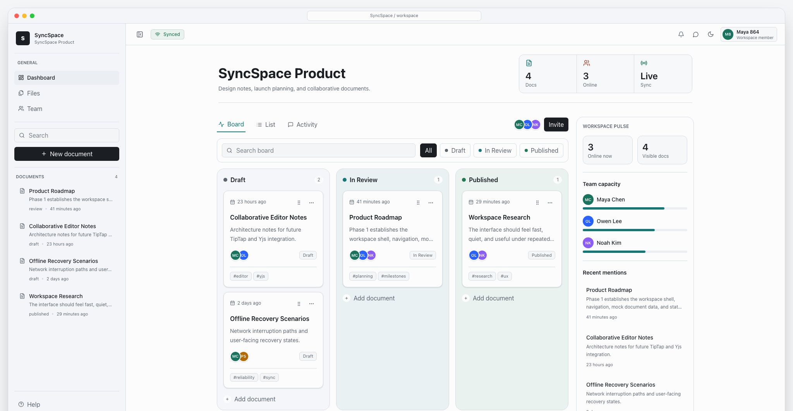

# SyncSpace

SyncSpace is a real-time collaborative workspace prototype based on the project proposal in `proposal.txt`.



This implementation now includes the Phase 1 foundation and the first collaboration backend:

- React, TypeScript, Vite, Tailwind CSS, React Router
- Zustand for persisted UI state
- TanStack Query for server-state access and mutations
- Node/Express REST API for workspaces and documents
- SQLite-backed metadata persistence in `data/syncspace.sqlite`
- Email/password authentication with hashed passwords and database-backed sessions
- Workspace membership roles: owner, admin, editor, and viewer
- Server-side authorization for workspace reads, document writes, deletes, and collaboration edits
- Team management screen for member listing, invitations, role changes, and member removal
- Pending invitations that are accepted automatically when invited users register
- TipTap rich-text editor with Yjs shared document state
- Authenticated WebSocket collaboration transport with reconnect status
- Persisted Yjs snapshots in SQLite
- Responsive workspace shell with collapsible navigation
- Drag-and-drop document board with status updates
- Optimistic board mutations with rollback on API failure
- Board search, status filters, and card menus for rename, duplicate, delete, and status changes
- Signed-in workspace identity, role display, and logout from the top bar
- Role-aware UI controls for read-only members and delete permissions
- Searchable document list and lazy-loaded editable document page
- Theme switching, live sync status, and active collaborator presence
- Vitest, React Testing Library, and Playwright collaboration tests

## Scripts

Use Node `22.12.0` or newer. The local API uses Node's built-in SQLite module.

```bash
npm install --legacy-peer-deps
npm run dev
npm run build
npm test
npm run test:e2e
npm run lint
```

`npm run dev` starts both the API server on port `8787` and the Vite app on port `5173`.

The browser app proxies `/api` and `/collaboration` requests through Vite during development.

Demo credentials are seeded automatically for local development:

- Email: `demo@syncspace.local`
- Password: `password`

## Remaining Implementation Phases

1. Move from local SQLite to PostgreSQL for deployed multi-user environments.
2. Add outbound email delivery for workspace invitations.
3. Add collaborator cursor rendering.
4. Add CI browser installation/cache strategy for Playwright.
